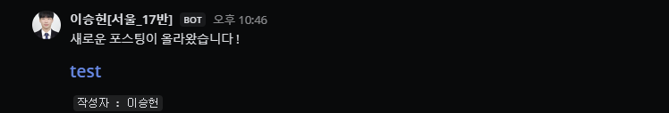

# M.M. Blog-bot

<br>SSAFY 10기_17반 기술 블로그 스터디에서 사용하는 MatterMost 블로그 크롤링 봇
<br>
<br>
<br>

1. Jsoup 라이브러리 - 블로그 크롤링
    - 현재 테스트 된 블로그 : 
      - tistory
      - velog
2. GithubActions - 자동화
   - 매일 오전 11시 작동

<hr> 

### 사용법


[Base64 인코딩](https://www.convertstring.com/ko/EncodeDecode/Base64Encode) 

1. Github Secret에 M.M. Webhook URL을 등록한다. 양식은 아래를 따른다.
<br> (** Base64로 인코딩 하여 사용한다 **)

Secret Name : SECRET_APP
```yaml
SSAFY : https://***.***.com/***/*******
```


2. 블로그 URL을 등록한다. 양식은 아래를 따른다.
   <br> (** Base64로 인코딩 하여 사용한다 **)

Secret Name : BLOG_URLS
```yaml
member:
  blogs:
    - author: "손흥민"
      link: "https://{id}.tistory.com/rss"
    - author: "BTS"
      link: "https://{id}.tistory.com/rss"
    - author: "봉준호"
      link: "https://{id}.tistory.com/rss"
    - author: "이승헌"
      link: "https://v2.velog.io/rss/{id}"
```

<br>
<br>
<hr> 

### 작동



```text
    새로운 포스팅이 올라왔습니다 ! 
    <link>
    <작성자 : {저자}>
```

<br>
<br>

